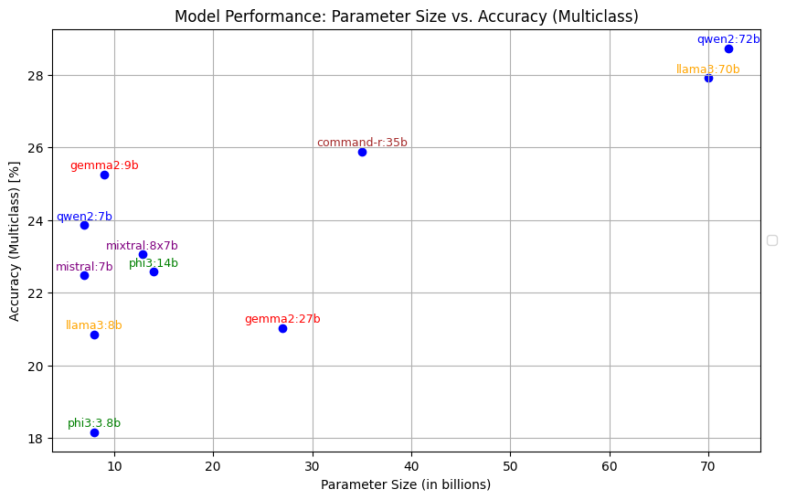
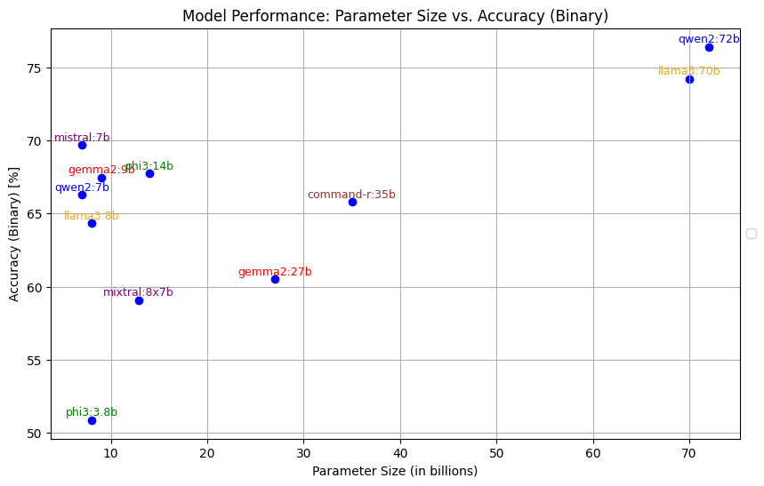

# FactCheck-LLM
This repository contains the performance results of different LLMs on fact-checking tasks.

You can see the results in the [metrics_graph.ipynb](https://github.com/basakbozkurt/FactCheck-LLM/blob/main/metrics_graph.ipynb) notebook.

This document outlines the step-by-step instructions required to run Ollama and includes the code for measuring performance of different LLMs on fact-checking tasks.

# Instructions for Running Ollama
 Follow the installation instructions provided to set it up on your machine.

## Download Ollama

If you are using Linux:

    curl -L https://ollama.com/download/ollama-linux-amd64 -o ollama
    chmod +x ollama

On Linux, you may need to run commands as follows:
    
    ./ollama

Or check Mac App or Windows app on: https://ollama.com/download/

## Download Models

To download models, use the following commands:

    ollama pull gemma2:9b
    ollama pull gemma2:27b
    ollama pull mixtral:8x7b
    ollama pull mixtral:8x22b
    ollama pull mistral:7b
    ollama pull llama3:8b
    ollama pull llama3:70b
    ollama pull qwen2:7b
    ollama pull qwen2:72b
    ollama pull phi3:3.8b
    ollama pull phi3:14b
    ollama pull command-r:35b
    ollama pull command-r-plus:104b

Note: You may need to run as ./ollama pull gemma2:9b on Linux

For more info on models, see this library: https://ollama.com/library.

# Generate predictions 
Before starting run ollama server:

On Mac: 

    run ollama app from applications

On Linux:
    
    ollama serve

To generate predictions:

    python main.py gemma2:9b
    python main.py gemma2:27b
    python main.py mixtral:8x7b
    python main.py mixtral:8x22b
    python main.py mistral:7b
    python main.py llama3:8b
    python main.py llama3:70b
    python main.py qwen2:7b
    python main.py qwen2:72b
    python main.py phi3:3.8b
    python main.py phi3:14b
    python main.py command-r:35b
    python main.py command-r-plus:104b

The output will be saved in the data folder.

 ## Check Output

To see how many predictions were completed:

    wc -l data/results_gemma2:9b.json

For real-time monitoring:

    tail -f data/results*.json 

# Generate Metrics

To generate accuracy and F1 scores:

    python score_generator.py gemma2:9b
    

# Evaluating Accuracy of LLMs
For a pilot experiment, I chose 1,000 samples for each category from a total pool of [21,152 PolitiFact claims](https://www.kaggle.com/datasets/rmisra/PolitiFact-fact-check-dataset/data) to ensure equal representation. This approach helps us eliminate any bias that might arise from imbalanced data. If I had reflected on the actual distribution of claims, some categories might have been underrepresented, potentially skewing the results and affecting the reliability of our model comparisons. 
In the preprocessing step, I eliminated instances where the models refused to respond.

## Models
I selected 11 models from 6 different LLM families, as shown in table. This choice is informed by their open-source nature and their representation of the latest advancements in the field.

| **LLM Family** | **Parameter Count**                                                                                                 | **Provider**     | **Release Date**                                                                                                                                  |
|-----------------|---------------------------------------------------------------------------------------------------------------------|------------------|--------------------------------------------------------------------------------------------------------------------------------------------------|
| Mixtral         | 8x7B [[1]](https://mistral.ai/news/mixtral-of-experts/) / 8x22B [[2]](https://mistral.ai/news/mixtral-8x22b/) | Mistral AI       | 11/12/2023 [[1]](https://mistral.ai/news/mixtral-of-experts/), 17/04/2024 [[2]](https://mistral.ai/news/mixtral-8x22b/) |
| Command R       | 35B                                                                                                                | Cohere           | 11/03/2024 [[3]](https://cohere.com/blog/command-r)                                                              |
| Llama 3         | 8B/70B                                                                                                            | Meta             | 18/04/2024 [[4]](https://ai.meta.com/blog/meta-llama-3/)                                                                                  |
| Phi-3           | 8B/14B                                                                                                            | Microsoft        | 21/05/2024 [[5]](https://azure.microsoft.cous/blog/introducing-phi-3-redefining-whats-possible-with-slms/)                                                                      |
| Qwen-2          | 7B/22B                                                                                                            | Alibaba Cloud    | 07/06/2024 [[6]](http://qwenlm.github.io/blog/qwen2/)                                                                                    |
| Gemma 2         | 9B/27B                                                                                                            | Google           | 27/06/2024 [[7]](https://blog.google/technology/developers/gemma-open-models/)                                                                              |

*Table: The LLM families used in the study.*

---

## Prompting

Text generation with LLMs depends significantly on the prompting methods employed. The prompts for this thesis were developed based on the outputs of Paper I. In this pilot experiment, a simple prompt was used to have LLMs fact-check a claim, aligning with previous studies (e.g., [Hoes et al. (2023)](https://doi.org/10.31234/osf.io/qnjkf), [Quelle and Bovet (2024)](https://www.frontiersin.org/journals/artificial-intelligence/articles/10.3389/frai.2024.1341697/full)). This approach ensures the use of prompting methods likely to be used by the general public ([DeVerna et al., (2023)](https://doi.org/10.48550/arXiv.2308.10800), [Karinshak et al., (2023)](https://dl.acm.org/doi/10.1145/3579592)). Although more sophisticated prompting techniques exist and may enhance accuracy, they often require technical skills that are less commonly possessed by lay users.

LLMs were instructed to annotate each statement (see **System Prompt** below). Six categories and their definitions from PolitiFact’s Truth-o-Meter ratings were used to ensure a straightforward comparison of ChatGPT’s findings with PolitiFact’s fact-checkers ([Drobnicholan, 2018](https://www.politifact.com/article/2018/feb/12/principles-truth-o-meter-politifacts-methodology-i/)). 

The labels range from **TRUE** to **PANTS ON FIRE**, with intermediate categories such as **MOSTLY TRUE**, **HALF TRUE**, **MOSTLY FALSE**, and **FALSE**. Additionally, similar to previous studies ([Hoes et al. (2023)](https://doi.org/10.31234/osf.io/qnjkf), [Quelle and Bovet (2024)](https://www.frontiersin.org/journals/artificial-intelligence/articles/10.3389/frai.2024.1341697/full)), a new label, **INCONCLUSIVE**, was added to be used when a claim lacks sufficient context or there is not enough information to assess its veracity.

---

### System Prompt

> **You are a fact-checking expert.** Evaluate the given statement and assign one of the following labels:
>
> - **TRUE** – The statement is accurate, and nothing significant is missing.
> - **MOSTLY TRUE** – The statement is accurate but requires clarification or additional information.
> - **HALF TRUE** – The statement is partially accurate but omits important details or takes things out of context.
> - **MOSTLY FALSE** – The statement contains some truth but ignores critical facts that would provide a different impression.
> - **FALSE** – The statement is not accurate.
> - **PANTS ON FIRE** – The statement is not accurate and makes a ridiculous claim.
> - **INCONCLUSIVE** – A clear decision cannot be made due to insufficient context or information.
>
> Provide the assigned `{label}` along with a detailed `{explanation}` supporting your assessment.

---

## Accuracy Metrics of LLMs on a Sample of PolitiFact Claims

The graphs below show the accuracy metrics and parameter sizes of LLMs, each tested on 6,000 PolitiFact claims. 

- The results for **multiclass categories** (see Figure 1) and **binary categories** (see Figure 2) indicate a general trend where larger models tend to achieve higher accuracy, though there are exceptions where smaller models outperform larger ones.
- **Qwen2-72b** stands out with the highest accuracy and largest parameter size, while **Phi3-3.8b** has both the smallest parameter size and lowest accuracy.
- Despite having a significantly larger parameter size, the performance of **Gemma2-27b** did not scale proportionally.

---

### Figures

#### Figure 1: Model Performance (Multiclass)

#### Figure 2: Model Performance (Binary)

